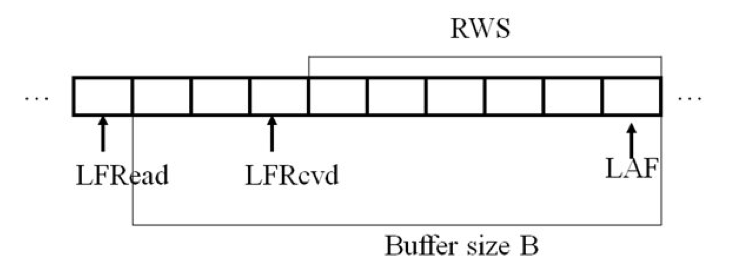

Programming Assignment 2 Go-Back N, Sliding Windows and Window-Based Flow Control
=================================================================================

Due Friday, October 4th by 11:55 pm

Groups
------

Students may work in groups of two but groups are not necessary. Please send an email to the TA (Daniel.Rosen@colorado.edu) once you have established a group. You are each responsible for complete understanding of your code and implementation of Go­Back N. Grading sessions will be conducted individually. [4273 and non­4273 cannot work together]

Purpose
-------

1.  An understanding of reliable transmission transport layer protocols
2.  An understanding of cumulative acknowledgements
3.  An understanding of sliding windows
4.  An understanding of sequencing packets 
5.  An understanding of flow control

Overview
--------

In this assignment, we are going to build a reliable Go­Back­N transmission on top of UDP sockets. Students will implement three important protocol features of Go­Back­N: sliding windows at both the sender and receiver; timeouts at the sender; and cumulative acknowledgements. Students in non­4273 courses will also implement window­based flow control to handle slow processing of data.

For this protocol, you will need to design a client application and a server application, e.g. a Go­Back­N client and a Go­Back­N server. The client application will reside on one machine or host, while the server application will reside on a remote host. The client application must be able to reliably transmit data to the server via your protocol over UDP sockets. The server application must be able to send positive cumulative acknowledgments (ACKs) of received data packets back to the client via UDP sockets. Thus, the client application must be capable of sending data packets and receiving acknowledgment packets. Conversely, the server application must be capable of receiving data packets and sending acknowledgment packets.

Requirements
------------

* reliably transfer a data file between a client and server despite packet losses in both directions
* implement sliding windows with cumulative acknowledgements
* implement timeouts at the sender (50ms), and retransmit a window of N packets upon a timeout (Go­Back­N)
* buffer out­of­order packets at the receiver
* discard packets outside of the window
* implement window­based flow control such that the receiver's advertised window size dynamically adjusts to the receiver's ability to process
* transfer logs

Sliding Window
--------------

Your GBN protocol will implement sliding windows with cumulative acknowledgements. The receiver/server's cumulative acknowledgement will specify the highest sequence number that the server has received. All packets with sequence numbers less than or equal to the cumulative ACK's value must already have been received at the server. For more detail on cumulative ACKs and GBN, see the textbook and the lecture slides. Three examples are given here to explain how this should work:

### EXAMPLE 1 ###

SWS = RWS = 6: Client sends packets with sequence numbers 0,1,2,3,4,5. Server receives all of them ­ no packet loss.

* At the server: As each data packet arrives, this should trigger your protocol to send an ACK back. For example, when the first data packet arrives (seq # = 0), the server first sends back ACK=0 and slides the RWS to 1,2,3,4,5,6. Next, when the second data packet arrives (seq # = 1), the server sends back a cumulative ACK=1 and slides the RWS to 2,3,4,5,6,7. At the end of this activity, the RWS should be expecting 6,7,8,9,10,11. [Note: though the receiver could delay sending acknowledgements, and then send just one cumulative ack for a burst of received data packets, do not use this optimized scheme in this assignment.]
* At the client: The client sent the first six packets, and starts the timer for each packet sent. The client's window slides forward as each ACK arrives. For example, when ACK=0 arrives, slide the window forward to 1. When ACK=1 arrives, slide the window forward to 2, and so on. Note that the timers for unacknowledged packets keep ticking down and are not reset.

### EXAMPLE 2 ###

SWS = RWS = 6, but now both data and ACKs can be lost or reordered. Suppose the client sends 0,1,2,3,,4,5 and only data packet 2 is lost, and all ACKs are lost.

* At the server: Server gets 0,1,3,4,5 but packet 2 is lost on the way so the server sends back cumulative ACK=0 and ACK = 1 and slides the receive window to 2,3,4,5,6,7. When the server receives out­of­order packet 3 but not packet 2, then the server generates a cumulative ACK=1 (this is also called a duplicate ACK, because ACK=1 was already sent). Your server should also buffer out­of­order packets, for increased efficiency and advertise the correct RWS. This is useful in case the GBN client has to retransmit a whole window of packets. For example, it is possible in this example that retransmitted packet 2 arrives but retransmitted packet 3 is lost. Because you've already saved packet 3 from before, then you can now slide your window forward past packet 3; otherwise, you could only slide your window past packet 2. Buffering out­of­order packets achieves improved efficiency/throughput.
* At the client: Suppose all acknowledgements are lost. In this case, the client will timeout and immediately resend all packets in the sending window (Go­Back­N). For this example, when ACK=0, ACK=1, and the duplicate ACK=1 are all lost, then the client will timeout and resend packets 0,1,2,3,4,5. Please set your client's timeout to 50 ms.

### EXAMPLE 3 ###

SWS = RWS = 6: Client sends packets with sequence numbers 0,1,2,3,4,5. Data packet 2 is lost, and all ACKs (ACK=0, ACK=1, and duplicate ACK=1) are received by the client.

* At the server: same as Example 2.
* At the client: When ACK=0 is received, slide the client's window right by one. When ACK=1 is received, slide the window right by one. When duplicate ACK=1 is received, do not retransmit packets 2,3,4, and 5 until a timeout. The client should only resend packets when a timeout occurs.

Window-based Flow Control
-------------------------

Initially you should set RWS to be 6 and SWS to be nine. Note the mismatch between sender and receiver buffers. Your client will be sending more data than the server can handle. Your server should discard packets outside of the acceptable window, i.e. discard those sequence numbers above or below the current window. Use fixed­sized packets of 1,024 bytes for this assignment.

Window­based flow control requires that the server embeds its receive window size, RWS, within each cumulative ACK. Your ACK should contain both the cumulative seq # as well as the RWS=# of slots left. This is how a server tells a client to slow down the client's transmission rate. The client can send no more than RWS packets, starting from the cumulative sequence # of the ACK. For example, if the client receives an ACK(seq=2, RWS=5), then the client is restricted to sending packets 3,4,5,6,7. This is true even if the client is capable of sending more than 5 packets. In essence, the sending window size SWS is forced to track the receiving window size RWS.

Let's reconsider the example of section 1, in which SWS and RWS start at 6, and the client sends data packets 0,1,2,3,4,5. Suppose packets 0 and 1 are received correctly. First, the server receives packet 0. What ACK should it generate? It depends on how fast the receiving application is retrieving packets from the GBN server. If the application is slow, then we should generate ACK(seq=0,RWS=5), because packet 0 is occupying space in the receive buffer but has not yet been retrieved by the receiving application from the GBN server. If the application is fast, then the server should generate ACK(seq=0,RWS=6) because packet 0 has already been processed.

**[4273]** During your normal operation, we'll just assume that the receiving application empties received packets from the GBN server's buffer as soon as it gets them unless they buffered because they are out of order. Thus, typically as data packets of the file being transferred arrive at the receiver, they should be written/appended to the output file almost immediately. At the client, an ACK(seq=0,RWS=6) is received, and the sender slides its lower left edge of the SWS (=LAR) forward by one, and is capable of sending packets 1,2,3,4,5 and 6. Similarly, when ACK(seq=1,RWS=6) is received next, the SWS is slid forward by one, and the client can send packets 2­7. Note that if you have buffered out of order packets you will advertise RWS < 6. You will never reach RWS = 0 because if 5 packets are buffered then you must be missing the first packet and once this packet is received you can write all 6 packets and advertise RWS = 6.

**[non­4273]** You must implement flow control so that your server can handle available buffer size due to slow processing of data. Do not assume that the receiving application empties received packets from the GBN server's buffer as soon as it gets them, i.e. the server sends ACK(seq=0,RWS=#) where # is the currently available receiver window size. Thus, typically as data packets of the file being transferred arrive at the receiver they are acknowledged before the process finishes writing data to file. Therefore receive space will only become available again once data has finished writing to file. At the client, an ACK(seq=0,RWS=#) is received where # is the currently available receiver window size, and the sender slides its lower left edge of the SWS (=LAR) forward by one, and is capable of sending packets up to the RWS. You must demonstrate the ability to get out of the state where receiver advertises RWS = 0 including when packets are dropped.

Command Line Requirements
-------------------------

The command­line usage of your programs should follow:

		./GBNserver <server_port> <error_rate> <random_seed> <output_file> <receive_log>
		./GBNclient <server_ip_address> <server_port> <error_rate> <random_seed> <send_file> <send_log>

Transfer Files
--------------

You are free to choose any input file to reliably transfer. Sizes of about 100 KB should be sufficient to test your protocol.

Logs
----

Log files are needed for both the client and server.

At the client side, the format should be:

	<Send | Resend | Receive> <Seq #> [Free Slots] <LAR> <LFS> <Time>

Free Slots is only logged when the client receives an ACK with that information. LAR and LFS are pointers as defined in the textbook and lecture slides.

The server's log format should be:

	<Send | Resend | Receive> <Seq #> [Free Slots] <LFRead> <LFRcvd> <LAF> <Time>

Free Slots is only logged when receiver is about to send an ACK. LFRead, LFRcvd, and LAF are pointers as defined in the figure and lecture slides.

Programming Language and Compiling
----------------------------------

Your Go­Back­N protocol must be written in C, and your client and server programs must be compiled, executed and tested on the CSEL Linux cluster.

Forcing dropped packets
-----------------------

We are providing you with a sample tar file containing a sample server, sample client, and a sendto_.h file. Both your client and server must call C functions sendto_() and init_net_lib() from the .h file. The sendto_() will replace UDP's sendto(), but has the exact same parameters. The reason we're using sendto_() is that it introduces packet dropping errors. You should use sendto_() to send data from the client and acknowledgements from the server. To set up the packet dropping probability correctly, use init_net_lib() as shown in the sample code.

Server Explanation
------------------

Basically, the following server with the sliding window shown in the figure below should be implemented. Choose a receive buffer size of 6 packets. Your initial advertised RWS will be 6 packets. Your server's GBN layer will typically be sleeping in recvfrom() or select() waiting for data packets. Upon waking up at the arrival of a data packet, the server should:

1. If the packet is within the receiver's window, move LFRcvd appropriately and adjust RWS appropriately. If the packet is outside of the receiver’s window then discard it.
2. Next, decide how much to slide LFRead forward by, i.e. how much data will have been read by the application since the last time the server's GBN code woke up
	*  If this packet is the next packet in the sequence then write/append this packet and any subsequent packets that had been received out of order. After writing packets increase the receiver’s window size.
	*  If this packet is not the next packet in the sequence then buffer the packet until it can be written.
	*  Once the last data packet is written then close the output file immediately. Also close the server log file. Then, terminate your server.You're done.
3. server goes back to sleep 

LFRead is the last packet read by the application layer, LFRcvd is the last packet correctly received from the client, and LAF is the largest acceptable frame.

Grading
-------

Turn in a tar file containing the following:

* GBNclient.c code
* GBNserver.c code
* Makefile ­ compiles GBNclient.c and GBNserver.c into GBNclient and GBNserver using gcc
* README

README
------

A proper readme file contains the following:

* Author Information
* Description of application
* How to compile and execute application
* Which of the following functions work
	- reliably transfer a data file between a client and server despite possible packet losses (packet error rate will vary during our testing to evaluate the correctness of your protocol implementation)
	- sliding windows at both the client and server, with cumulative acknowledgements
	- timeouts with retransmission
	- discarding of out­of­range packets
	- buffering out­of­order packets
	- **[non­4273]** window­based flow control such that the receiver's advertised window size dynamically adjusts to the receiver's ability to process
* Technical details of the application

Late policy
-----------

The late policy for programming assignments is as follows: 10% off if submitted before your grading session; no credit if submitted after your grading session.

If more explanation becomes necessary, we will post further clarifications on the moodle.

Questions and Hints
-------------------

### Hint I ###

In order to build an ARQ protocol: start simple. Begin by seeing if you can set up our provided mock UDP sockets, and see if you can transmit a single small packet between a client and server on the same host. Then build Go­Back­N with zero probability of error, a small transfer file, and a fixed large window size, to test cumulative ACKs only. Then add window­based flow control. Next, increase the probability of error and eventually transfer a test file of your choosing (should be about 100 KB) between two remote hosts on the CS Linux cluster.

### Hint II ###

After you've compiled your client application and your server application and linked in our socket , then start the server application (receiver) first, followed by the client (sender).

### Question I ###

***How does giving the error probability value at the command prompt introduce error in the network?***

The code sendto_() function will drop packets at a certain probability of error. To set the sendto_() function's packet error rate, first read in the probability of packet of error from the command line argument. Next, call the init_net_lib() function and pass in the probability of packet error from the command line argument. Then, in the rest of your program, you can call sendto_(), which will now drop packets at the specified packet error rate.

### Question II ###

**What should be the contents of the packet header?**

The packet header will differ in the forward and reverse directions. In the forward client­to­server direction, the header should contain the sequence number and any other information you deem appropriate to use. In the reverse server­to­client direction, the acknowledgment should contain at least i) the cumulative sequence # that has been received up to that point and ii) the current window size/advertisement. Your design choices should be well documented in the code.

### Question III ###

**What should be the choice of machines to test the protocols?**

You should test your client and server using the machines in the CSEL Linux cluster. The IP address of the server machine would be passed as a command line argument to the client. You can start testing by having your client and server on the same host.

### Question IV ###

**Is blocking wait the only option available for sockets?**

We recommend you judiciously apply select() when appropriate. Type 'man select' to find out about this very useful function. You can use it in place of recvfrom(). select() can be thought of as a general recvfrom() that allows a receiver to wait to receive packets from many sockets, and also can timeout on waiting if no packets are received.

### Question V ###

**Should sendto_() be used for ACKs as well as data?**

Yes, you will need to call sendto_() to transmit both data (client­>server) and ACKs (server­>client). Your protocol must be robust enough to handle lost data as well as lost acknowledgements.

### Question VI ###

**How important is it that the server terminate cleanly, i.e. deals with the last ACK correctly?**

For this assignment, please terminate your server cleanly. That means, after you receive the last packet of data for the file you are transferring, you should as usual slide the window forward and send a cumulative ACK. Then, you should immediately write all data to your output file and close the output file. You should also close any other open files, such as the server log file. As a final step, you should then immediately terminate your server.

### Question  VII ###

**What should the client do if the last ACK is lost?**

On the client side, the last ACK could be lost. In this case, the client will retransmit, but your server will have already terminated. To terminate the client cleanly, your program should implement the following solution to the last ACK problem: the client should retransmit the last data packet at most ten times, and then should close any open files such as the client log file and then terminate. Clarify your solution in the README that you turn in.

### Question VIII ###

**When you say use fixed packets of 1024 bytes, do you mean 1024 bytes of file transfer data only or should the header info (which I believe would just contain the sequence #) be part of the frame size?**

You can include header bytes in the 1024 byte total, or you can add header bytes to the 1024 byte total. Document your choice in your README

### Question IX ###

**Also, if the server only needs to send ACKs, does it need to pad a packet to be 1024 bytes?**

No, ACKs do not have to be 1024 bytes total or you can pad them to 1024 bytes. Document your choice in your README

