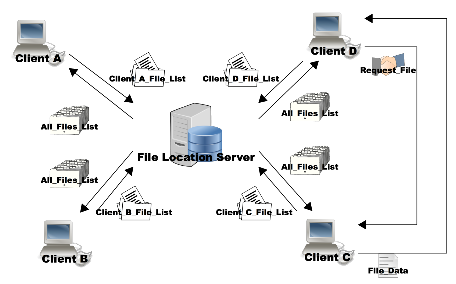

Programming Assignment 4 Peer to Peer File Server (Encrypted)
=============================================================

Due Monday, December 9th by 8:00am

Groups
------

Students may work in groups of two but groups are not necessary.Please send an email to the TA ( Daniel.Rosen@colorado.edu ) once you have established a group.  You are each responsible for complete understanding of your code and implementation of the assignment and you must each submit an assignment for grading.  Grading sessions will be conducted individually and you cannot share code with other teams.

Requirements
------------

* Implement a file location server over TCP (server_PFS)
* Implement a peer to peer file distribution service over TCP (client_PFS)

In this assignment you will create a peer to peer file distribution service.  In order to locate files and peers you will also implement a file location server.  Each client will register its name and its list files with the location server.  The location server distributes the complete list of filenames and file locations to each client.  Clients then go directly to peers to obtain the file they desire.

Graduate/CAETE Requirements
---------------------------

(Extra Credit for Undergrads / 10 pts)

* Administration of certificates using the OpenSSL command line tool
* Message Encryption using the OpenSSL c library

Communication between each node will be encrypted using TLS.  Signed certificates will be issued using the OpenSSL command line tool and creating your own certificate authority.  Then a secure connection is established using private keys and certificates.  Secure connections must be verified using the certificate of the certificate authority.

Network Structure
-----------------

File Location Server
--------------------

* Accept/Reject client names
* Register clients
* Deregister clients
* Add files to master file list
* Remove files from master file list
* Distribute master file list to all registered clients
* (Exit can be done ctrl+c)

There will be one file location server listening running on a known address.  The file location server will receive client names and reject client names already in use. Then the file location server will receive file lists from each client and compile them into one master file list.  The master file list contains the filenames, file size and file locations (client name / IP Address / Port Address) of files and is distributed to all registered clients.  The master file list is pushed out to all registered clients whenever the list changes. As clients start up they register with the file location server and add their file list to the file location server.  As clients shut down their files are removed from the master file list.  When the file server receives an “ls” command it returns the current master file list to the request originator.

### Usage

	./server_PFS <Port Number>

or

	./server_PFS <Port Number> <Private Key of Server> <Certificate of Server> <CA Cert>

Clients
-------

* Register name with file location server
* Register files with file location server
* Request master file list from file location server ­ ‘ls’
* Print master file list
* Get file from another client ­ ‘get’
* Provide file to another client
* Exit current client ­ ‘exit’

There will be n clients (must handle 3 or more) executing identical code.  Each client will startup and open a listening TCP for incoming ‘get’ requests.Then the client will register its name with the file location server.  No two clients can register with the same name.  Therefore if the server returns that this name already exists then the client just exits.  The client then sends its list of files  and their sizes to the the file location server.The file location server then returns the master file list and this is printed out to the client terminal.  If the master file list is updated at the file location server it will be pushed out to the client and the client should print the new file list to the terminal.  Once the client startup process is complete the user can:

1. request a new list of files from the file location server using the ‘ls’ command and print this to the terminal  request.
2. request a file directly from a peer client using the master list obtained from the file location server using the ‘get’ command.  After file is received close this connection.
3. exit using the ‘exit’ command 

Please execute clients in separate directories if testing on the same machine.  Transferred file must be identical to orginal file.  md5sum <filename> profides of hash of the file, which can be used to quickly compare two files.

### Usage

	$ ./client_PFS <Client Name> <Server IP> <Server Port>

or

	$ ./client_PFS <Client Name> <Server IP> <Server Port> <Private Key of this Client> <Certificate of this Client> <CA Cert>

Master File List
----------------

Please print out the master file list as follows

	File name || File size KB || File owner || Owner IP || Owner Port
	foo1 || 22 KB || A || 192.168.1.2 || 40001
	foo2 || 1 KB || A || 192.168.1.2 || 40001
	foo3 || 1 KB || B || 192.168.1.3 || 40005

Certificates (Mandatory for Graduate Students / E.C. for Undergrad)
-------------------------------------------------------------------

### Certificate Creation

Usually you would receive your signed public key certificate from a well­known and trusted Certificate Authority (e.g. VeriSign, GlobalSign, GoDaddy, etc.). However for the purposes of this assignment, you (the student) will be considered a well­known and trusted authority (only within the domain of this assignment of course).

### Here is what you will need to generate

CA certificate – this is the CA’s public certificate that’s used to validate security certificates that have been signed by the CA. The file corresponding to this certificate is cacert.pem (in ./demoCA) Signed Certificate: This is your certificates signed by the CA which include a public key. This corresponds to the file clientX.cert or server.cert (in your temporary directory). Private Key: These are the corresponding private keys to the public keys contained in each signed certificate.  They are needed to initiate public key cryptography. You should put these files with the source code of your project so you don’t lose them (you will be turning them in with your assignment). NOTE: DO NOT COPY OTHER STUDENTS private keys/security certificates/public keys. This will be considered plagiarism. Note: Include your files with the source code of your project so you don’t lose them (you will be turning them in with your assignment). NOTE: DO NOT COPY OTHER STUDENTS private keys/security certificates/public keys. This will be considered plagiarism. If you want to know more about what you just did (or set more configuration options – there are a lot of pieces of information you can attach to a CA certificate), you can look at some of these websites:

* http://www.ulduzsoft.com/2012/01/creating­a­certificate­authority­and­signing­the­ssl­certificates­using­openssl/
* http://www.freebsdmadeeasy.com/tutorials/freebsd/create­a­ca­with­openssl.php
* Quick OpenSSL command line reference: http://wiki.samat.org/CheatSheet/OpenSSL

### Certificate Authority Setup

In order to generate a CA for yourself, here’s what you should do.

1. If you haven’t already, make sure you install OpenSSL command line. Note you may want to reinstall OpenSSL to include the API. http://www.openssl.org/source/ Note: your OpenSSL configuration (see openssl.cnf file in your OpenSSL Library) file will default your CA directory to ./demoCA
2. Create a temporary directory, cd into into, then type the following:

	* mkdir ./demoCA; mkdir ./demoCA/newcerts; mkdir ./demoCA/private
	* echo “01” > ./demoCA/serial; touch ./demoCA/index.txt;
	* openssl req ­new ­x509 ­keyout ./demoCA/private/cakey.pem ­out ./demoCA/cacert.pem

You will be prompted for several pieces of information, such as state, county, your name, organization, and so on. Feel free to fill this in with whatever you please, but to make more concrete I would recommend using real information. You will also be asked to give a passphrase,  which is used whenever you wish to sign a public key certificate. For the sake of this assignment (so the TA’s may debug your CA if necessary), please set this to "cu_cs_netsys" (all lower case).  If you choose not to use this passphrase then I cannot help you create/debut signing certificates.

Congratulations! You’ve just created your CA’s private key (cakey.pem) and public certificate (cacert.pem), thereby making you a Certified Authority!  Your cacert.pem must be included in your submission in order to verify certificates.

### Private Key / Cert Pairs0 

Now you must generate a public/private key pair for each process to communicate. The public key will be packed inside what is known as a “Certificate Signing Request” (CSR), which is a special type of file that is given to the CA. Once the CA signs it, it becomes a full blown Security Certificate which can be verified using the CA certificate (cacert.pem). In order to generate your public/private keypair, type the following command in your terminal:

	openssl req ­nodes ­new ­keyout clientA_priv.key ­out clientA_cert_req.csr ­outform PEM keyform PEM

No challenge password or optional company name are needed but your location must match the ca location because we are self­signing certificates.  Enter through these prompts.  This generates a CSR and the corresponding private key.  You should generate individual certificates for each client and the file location server and name them correspondingly.  Please follow these naming conventions (for this assignment).  clientX_priv.key or server_priv.csr where X is the name of a client. 

### Signing the CSR as a CA 

As the CA, you can now sign the server’s public key with your private key, turning it into a Security Certificate. To sign the CSR, type the following in the terminal:

	openssl ca ­in clientA_cert_req.csr ­out clientA.crt

And there you have it, clientA.crt is your public key signed by the CA for one of your clients.  You should do this for each private key / csr pair you previously generated (this is each client and the file location server).  Please follow this naming convention (for this assignment)  clientX.crt or server.crt 

Encryption (Mandatory for Graduate Students / E.C. for Undergrad)
-----------------------------------------------------------------

Now that you have generated private keys and certificates (including a certificate for the CA) let’s put them to use.  After creating your TCP socket all communication should be conducted through SSL/TLS. Before communication starts you must verify the certificate provided by the remote host.  If verification fails then you should not communicate with that machine.  After verification all communication must pass through the SSL (Secure Socket Layer.) The following documents provided by hp are very extensive.  I recommend reviewing them:

	http://h71000.www7.hp.com/doc/83final/ba554_90007/ch04.html

### Verification 

See "Setting Up Peer Certificate Verification"

	http://h71000.www7.hp.com/doc/83final/ba554_90007/ch04s03.html#ssl­handshake­sect

Some SSL development resources

* http://www.ibm.com/developerworks/linux/library/l­openssl/index.html
* http://www.openssl.org/docs/

To be turned in
---------------

You should name your client code client_PFS.c, and create an executable called client_PFS. You should name your server code server_PFS.c, and create an executable called server_PFS.

* client_PFS.c
* server_PFS.c
* makefile ­ compiles client_PFS.c into client_PFS and server_PFS.c into server_PFS
* README.txt

For SSL/TLS

* cacert.pem (the ca certificate used to verify host certificates.)
* server.key and server.crt (used by the server to establish SSL)
* at least 2 clientX.key and clientX.crt (used by the clients to establish SSL)

Grading
-------

You should submit all of the above to the Moodle by the deadline. The code should be well­ documented enough so that we can verify that the server and client work correctly. The README should briefly explain the structure of your system and explain which of the following aspects of the assignment work or do not work:

* clients are able to connect to the server via TCP
* clients connect and disconnect from peers appropriately in order to retrieve files
* clients can execute the commands above (‘ls’,’get’,’exit’)

	*‘ls’ retrieves latest file list and prints to console
	*‘get’ retrieves file directly from peer
	*‘exit’ exits client

* server adds to and removes from master file list appropriately
* server provides a master file list to all clients
* grad students: certificate creation using the openSSL command line tool
* grad students: SSL encrypted communication

Late policy
-----------

Standard Late Policy applies.

Clarification
-------------

If more clarification becomes necessary, we will post further clarifications on this Web page.

