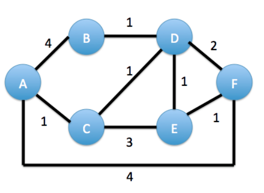
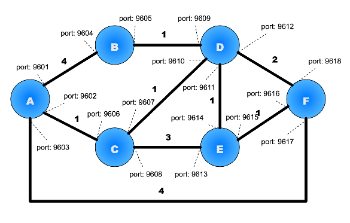

Programming Assignment 3: Link State Routing
============================================

Due Friday, November 15th by 11:55 pm

Groups
------

Students may work in groups of two but groups are not necessary. Please send an email to the TA (Daniel.Rosen@colorado.edu) once you have established a group.  You are each responsible for complete understanding of your code and implementation of Link State Routing and you must each submit an assignment for grading.  Grading sessions will be conducted individually.

Purpose
-------

* learn how to establish and maintain TCP connections
* learn how distributed dynamic routing protocols accomplish packet routing
* implement a link state routing protocol

I. Introduction
---------------

In this assignment, you will be asked to build a link state routing protocol that implements reliable flooding and Dijkstra's forward search algorithm.

Figure 1 shows the topology of the network that you will be building with nodes and link costs based on the configuration file posted to the moodle. Each router will be a separate UNIX process that communicates with other routers by exchanging TCP messages through the TCP socket interface. Each router implementation must be written in C on Linux.  Each of your routers will be identical, running the same routing code. You should be able to start your routers in any order.  This proves challenging because you cannot connect to a socket that is listening and you cannot listen for a connection on a socket that has failed to connect.  Please see the suggestions written under supplementary information.

The router processes should then begin flooding routing updates in the form of TCP link state packets between neighbors. As each link state packet arrives, each router should execute again its shortest path algorithm and construct a routing/forwarding table. Then, it should forward the LSP along all outgoing links to achieve reliable flooding. After each router's LSP packets have flooded at least once, the routing tables should converge to a stable state. You should be able to verify by inspection that the stable routing tables will route packets along the lowest cost paths. You must log each receipt of link state packets and the routing tables built by the shortest path algorithm. In order to close all logs and shutdown each router successfully can accept input from standard in or transmit a control packet that signals each router to close.  The latter requires a mechanism for injecting the control packet into the
network.

II. Configuration File - Initialization of Directly Connected Routers
---------------------------------------------------------------------

The configuration file posted to moodle corresponds to the network topology with ports drawn above. In order to alleviated conflicting port usage please work on your own machine or a CSEL lab machine to guarantee that no one else is using given ports. **Your assignment must work independent of the port numbers and link costs given in the initialization file.**

At startup, the neighboring nodes should find out about their immediate neighbors by reading the neighborhood topology information from the initialization file. The format of each line of this file is a five­tuple: 

    <source router, source TCP port, destination router, destination TCP port, link cost>

For example, the link between A and B contains the line `<A,9601,B,9604,4>`. When router A starts up, it should **read only** the lines of the initialization file where node A is listed as the source router. In this way, router A discovers only its immediate neighbors. It must not read any other lines, that is your router should discover all nodes that are not immediate neighbors by the reliable flooding of LSP's rather than reading directly from the initialization file (otherwise, that would defeat the whole purpose of this routing assignment!). For example, at start-up, router A should only read information from the initialization file about neighboring routers B, C and F, i.e. their link costs and TCP send & receive port #'s. To find out about the existence of (and shortest paths to) nodes D and E, router A must obtain this information by exchanging LSPs. Your router is not allowed to obtain this information from the initialization file. After many LSP floods, each router process will converge to the same list of all reachable nodes, though the shortest paths to the nodes will differ depending on what Dijkstra computes for each router. 

Note that you will run into issues establishing TCP connections.  If a router has not established a listening socket then the connect will fail and leave your socket in an unusable state.  If a TCP socket is listening then you will not be able to connect to a remote port through this socket.  Therefore you must establish a way to manage listening versus establishing a connection.

III. Building link state routing tables
---------------------------------------

You will be implementing link state (LS) routing using TCP to transfer link state packets. This is similar to how OSPF is implemented, but you will not have to implement the entire OSPF protocol. For simplicity and easier testing, let each LS router periodically advertise its link state to each of its neighbors every 5 seconds. For faster convergence, you can choose to speed up the LS advertisements to once per second, though you should document this in your README. The link state packet (LSP) advertised by routeri should contain a list of directly connected neighbors of i as well as the cost of the link to each one. You should include in the LSP additional header information such as ID of the node that created the LSP, sequence number of the LSP, length of the LSP, and time to live for this LSP. For example, the LSP for router A would advertise the following three links to neighbors of A:  

<table>
  <tr>
    <th>Neighbors of A:</th>
    <td>B</td>
    <td>C</td>
    <td>F</td> 
  </tr>
  <tr>
    <th>Link Cost:</th>
    <td>4</td>
    <td>1</td>
    <td>4</td> 
  </tr>
</table>

As each LSP arrives at a router interface, your TCP router process should first check whether it has seen this LSP before, i.e. is its sequence # less than or equal to the most recent sequence # that you've seen from this router source? If so, then discard the LSP and do nothing. If not, then proceed with Dijkstra, namely recalculate the link state routing table by implementing Dijkstra's shortest path tree algorithm, which can be found in the textbook and lecture slides. 

You are welcome to reduce your computation further by comparing the new LSP's topology information for router X to your current topology information for router X, and only invoke Dijkstra if there has been a change in the link connectivity for router X. In case there are two routes with the same link cost through different neighbors, then choose the neighbor with the lowest ID, i.e. A<B<C<D<E<F. At this point, you should then flood the LSP on all outgoing links, except the link from which the LSP arrived in order to accomplish reliable flooding. The initial routing/forwarding table at node A should look as below:

<table>
  <tr>
    <th>Destination</th>
    <th>Cost</th>
    <th>Outgoing TCP port</th>
    <th>Destination TCP port</th> 
  </tr>
  <tr>
    <td>B</td>
    <td>4</td>
    <td>9601</td>
    <td>9604</td> 
  </tr>
  <tr>
    <td>C</td>
    <td>1</td>
    <td>9602</td>
    <td>9606</td> 
  </tr>
  <tr>
    <td>F</td>
    <td>4</td>
    <td>9603</td>
    <td>9617</td> 
  </tr>
</table>

The final routing table at A (and all other routers) should be a function of the LSP updates that each router receives from the other routers and directly connected links. IV. Routing through port number (instead of physical interfaces) As shown in Figure 2, each router interface should have a distinct TCP port. For example, router A's UNIX process should open up sockets with distinct TCP ports to B, C & F, e.g. TCP port 9601 could represent the outgoing interface from A to B, while TCP port 9602 could represent the outgoing interface from A to C, etc. We have chosen distinct port #'s to simplify your testing and debugging. This way, you can run all of your routing processes on the same IP address (same laptop).

If you choose to test your routing implementation by placing at least one routing processes on a separate host, then you will only have to change the IP address of the remote router(s), not any of the port #'s. [Note: in an actual routing implementation, each routing interface will have a distinct IP address, rather than a distinct TCP port.] If you find that these port #'s are occupied on your machine(s), then you're free to modify the initialization file to use different distinct TCP port #'s above 5000. Please document this in the README.

V. Logging
----------

For this assignment, each routing process should print out to an output file the routing table, but only when there has been a change in the routing table. If an arriving LSP advertisement causes a change in the routing table, then you should print out the timestamp, the LSP that caused the change (including the neighbor it came from), and the new routing table. If an arriving LSP does not cause a change in the routing table, then you do not need to print anything (though while you're debugging, you may wish to print out the routing table for each arriving LSP). In the code that you hand in, you should only print a routing table for those LSP's that cause a change in the routing table.

VI. Command Line Execution
--------------------------

When starting a router, simply pass in its name, log filename and initialization filename in the command line, e.g. `./routed_LS <RouterID> <LogFileName> <Initialization file>` to start the router.

VII. Cleanly exiting
-------------------- 

After you've demonstrated that your network routing tables converge properly, then you're done for this programming assignment except for closing all output files cleanly. All routers should stop cleanly and save their output files. One way to signal to each router to exit and close its output file is to send a special exit packet to all routers A­F. For example, start a host X, using the call "routed_LS X", and include a conditional if() clause in the code of routed_LS.c such that if ID=X, then the code will send a TCP control packet to each router A­F and then exit.  In order to do so host X must be able to establish a TCP connection on a port number that is already listening. This will be a separate type of "exit" packet, distinct from the LSP updates. Host X's one­time duty is to cleanly signal to all routers to exit. When arouter receives an "exit" type packet on any of its TCP ports, then that router will close its output file and exit. You only need to send one exit packet to each router. A second way to exit is to accept input from the command line that will cleanly exit.  This can also transmit a control packet to reach directly connected router telling it to exit or each router can shut down individually.  Please document as to how you can cleanly exit your routers so that logs can be cleanly shut.

Grading
-------

You will be graded based on the accuracy of your implementation:

* is it a faithful implementation of link state?
* are the intermediate routing tables consistently converging towards a shortest path?
* are the final routing tables and lowest cost paths accurate?
* We will be testing your LS router implementations on a test topology that is the same as Figure 1, but with different link costs.
* Router Logs will be used to determine if LSP packets are correctly sent and received.

Late policy
-----------

Standard Late Policy Applies.

What To Turn In
---------------
You should test your programs thoroughly so that they do not crash or hang.  Your code must be organized and clear with comments/explanations for your functions and arguments.  Please turn in one tar file containing one routed\_LS.c source file one README.txt file and one makefile.  (routed is the name of the routing daemon on UNIX systems.)  The Makefile must compile routed_LS.c into routed_LS. The readme.txt file must explain which features of link state routing you were able tor unable to implement, as well as the values for the key parameters, etc. The documentation does not have to be long, but does have to be very clear.   The code that you turn in for this programming assignment must be your own original work and must compile and run on the CSEL machines. Upload the <YourName_PA3>.tar file containing the following files via the moodle.

* Link State Router file named "routed_LS.c"
* makefile – compiles "routed\_LS.c" into "routed\_LS" executables.
* README.txt file:
* Any other code you choose to include (.c, .h, etc..) i.e. You should turn in everything needed to compile your program.

Supplementary information
-------------------------

* Build your distributed router systems from the ground up. Begin by making sure a single router initializes properly. Then, make sure that two routers can pass routing updates to one another correctly. Then, implement the shortest path routing algorithm for LSP and check if the routing tables converge to the correct values.
* Even though an LSP may not have changed, we continue to periodically send out it out every 5 seconds. This is helpful in case a LS routing update is lost, and is useful for determining whether a router has failed. 
* As each router builds its shortest path tree, it will need to keep track of and store where each node was added onto its tree. When Dijkstra is finished, this information should be used to generate the next­hop routing table.
* Synchronizing listen versus connect can be tricky.  One way to do so is to start every router. Then determine if the router should listen for a connection or this router will connect but do not connect until every router is started.  You can use sleep and sleep for 15­20 seconds in order to give yourself time to start every router.
* A second way to do so is to blindly attempt to connect and if this fails then create a new socket for listening.  Then when the corresponding router initiates it should blindly attempt to connect and it will be successful.  Note that by default accept will block until the socket receives data. Therefore you do not want call accept before all ports that need to listen are listening.
* A third way to do so is to create multiple threads that continually attempt to connect to down links and if connections fail then they listen for some period until they try to connect again.

If more clarification becomes necessary, we will post announcements on this Web page.
