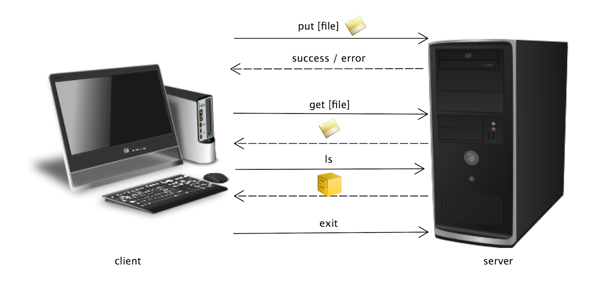

#Programming Assignment 1: UDP Socket Programming

due Friday, September 6th by 11:55 pm

**The purpose of this assignment:**

1.  An appropriate understanding of C language.
2.  An understanding of tools (compilers in Linux, shell,etc).
3.  Introduction to the socket programming interface.

In this assignment, you will build two programs in C, one for the client which will simply send a command and the other for a server which will send a suitable response back to the client.

##Program Requirements

**The client:**

1. The client must take two command line arguments: an IP address of the machine on which the server application is running, and the port the server application is using. [The IP address can be obtained using hostname -i . Type man hostname at the shell prompt for more information on how to use the hostname command.]
2. It should prompt the user to type any of the following commands  
    * get [file_name]
    * put [file_name]
    * ls
    * exit
    * It must then send the command to the server.
3. Then it must wait for the server's response. Once the server responds, it should print appropriate messages, if any, on the standard output.

**The server:**

1. The server must take one command line argument: a port number for the server to use. You should select port #'s &gt; 5000.
2. It should wait for a UDP connection.
3. Depending on the commands received, the server responds to the client's request in the following manner :
    * get [file_name]: The server transmits the requested file to the client (use files of small size in order of 2 to 5 KB for transfer like any jpeg file).
    * put [file_name]: The server receives the transmitted file by the client and stores it locally (use files of small size in order of 2 to 5 KB for transfer like any jpeg file).
    * ls: The server should search all the files it has in its local directory and send a list of all these files to the client.
    * exit: The server should exit gracefully.
    * For any other commands, the server should simply repeat the command back to the client with no modification, stating that the given command was not understood.

Notes:

*   Both the client and the server should be in a loop. For the purpose of this assignment, the client can be terminated by typing Ctrl-C.
*   The client side should contain at least three files with their names hard-coded as foo1, foo2, and foo3.

##What To Turn In:

You should test your programs thoroughly so that they do not crash or hang. Your code must be organized and clear with comments/explanations for your functions and arguments. &nbsp;Please turn in one tar file containing two .c source files one readme.txt file and one Makefile. The Makefile must compile both client.c and server.c into their respective executables. &nbsp;The readme.txt file must explain what you have done and how to run it. The documentation does not have to be long, but does have to be very clear. &nbsp;&nbsp;The code that you turn in for this programming assignment must be your own original work and must compile and run on the CSEL machines. Upload the tar file containing the following files via the moodle.

*   Client file named **client.c**
*   Server file named **server.c**
*   **makefile** – compiles "client.c" and "server.c" into "client" and "server" executables.
*   **README.txt** file

##Getting Started

(Please read as this may answer some of your questions)

Download the udp_example.tar file located on the Moodle. &nbsp;You can access the files from the main course page under the link ["Example tar file for Programming Assignment #1". ](http://moodle.cs.colorado.edu/mod/resource/view.php?id=3708)&nbsp;To extract files from udp_example.tar on a Linux machine, type 'tar -xvf udp_example.tar'. This should create a directory named “udp” which contains several files including “udp_client.c” and “udp_server.c” and testing files. These files contain a pseudo-code and not the actual implementation. You will have to modify both programs accordingly. After modifying the programs, following commands should be used to compile the programs.

To compile the files type:

*   gcc udp_client.c -o client
*   gcc udp_server.c -o server

To run the programs after compiling:

*   Run the server by typing : ./server [port_number]
*   Then run the client by typing : ./client [ip_address] [port_number]

The IP address is the server's IP address. The port number is the server's port number. You are informing the client where the server is located. You can test your application locally by running both the client and the server on the same machine. In this case, you can type localhost in place of the IP address. &nbsp;Feel free to use these files as a baseline for your design. You will have to modify parts of the code, especially for the server where parsing of the message is required.

###Header Files:

Examine the code in the provided programs. The list of header files that need to be introduced in the socket programming are listed below.

*   sys/socket.h : The header file socket.h includes a number of definitions of structures needed for sockets.
*   netinet/in.h : The header file in.h contains constants and structures needed for internet domain addresses.
*   arpa/inet.h : The header file contains definitions for internet operations.
*   netdb.h : This header file contains definitions for network database operations.

###Functions:

A brief explanation of some of the functions used in the code is provided here. However, for in depth understanding of the functions, please read the manpages of the functions.

*   socket() : The input parameters of the function lets you determine which type of socket you want in your application. It may be a TCP or UDP socket. The function returns a socket descriptor which can prove helpful later system calls or -1 on error. A quick look at the function:
*   bind() : Once we have our socket ready, we have to associate it with a port number on the local machine. It will return -1 on error. When calling bind function, it should be noted that ports below 1024 are reserved. Any port number above 1024 and less than 65535 can be used. A quick reference:
*   sendto(): This function is used to send the data. Since it is used in unconnected datagrams, the input paramater of this function includes the destination address.It returns the number of bytes sent on success and -1 on error.
*   recvfrom() : This function is used to receive the data from an unconnected datagram socket. The input paramters contain the address of the originating machine. It returns the number of bytes received on success and -1 on error

Note: It will be beneficial if you read the Beej’s Socket Programming guide (provided as a reference in this assignment) before starting the actual assignment.

**Non-blocking client (not required)**

Also, on the client side, it may be beneficial for you to configure a non-blocking socket, so the client does not lock up waiting for a message from the server in recvfrom(). If the socket receive buffer is empty for a blocking UDP socket, the calling application is put to sleep until a UDP datagram arrives. If a non-blocking UDP socket cannot return a complete datagram, then it returns immediately with an error status of EWOULDBLOCK, which you should check for. To set a socket as non-blocking, use fcntl(). A typical line might look like:

fcntl(sockfd, F_SETFL, O_NONBLOCK). Do a man for fcntl for more information. It will be easier to use a default blocking socket on the server side.

##HOW TO:

**Using Man Pages**

If you wish to read the man pages of any of the above functions, type man [function_name]. For example to check the man page of sendto, we will have to type man sendto. &nbsp;Press “q” in order to quit out of the man page.

Other useful C library methods to look up may be:&nbsp;atoi(),htons(),&nbsp;bzero(),bcopy(),&nbsp;strncmp(),strncpy(),&nbsp;fopen()

**Creating a tar file**

To create a tar file go down one directory level "cd ..", and type "tar -cvf [filename.tar] [directory]".

**CSEL Machines**

Your code must compile and execute on the machines in the CSEL Linux cluster. To create an account, go to [https://sac.colorado.edu](https://sac.colorado.edu/) (Select the host as CSEL and provide your CULoginName and Identity key password and "register.Then go to [http://csel.cs.colorado.edu](http://csel.cs.colorado.edu/) to login). &nbsp;You will be able to access your lab account via SSH from anywhere in the world (practically). &nbsp;If you have not previously used SSH, please follow the ITS Instructions here [http://oit.colorado.edu/ssh](http://oit.colorado.edu/ssh).

For the Host Name (aka server) use one of the following (elra == educational labs remote access):

*   elra-01.cs.colorado.edu
*   elra-02.cs.colorado.edu
*   elra-03.cs.colorado.edu
*   elra-04.cs.colorado.edu

**External References:**

Link to &nbsp;useful UNIX tutorial

*   [http://www.tutorialspoint.com/unix/index.htm](http://www.tutorialspoint.com/unix/index.htm)

Link to widely used Unix shell commands tutorial :

*   [http://infohost.nmt.edu/tcc/help/unix/unix_cmd.html](http://infohost.nmt.edu/tcc/help/unix/unix_cmd.html)

Following is the link to a simple UDP client/server system in C/Unix environment

*   [http://www.abc.se/~m6695/udp.html](http://www.abc.se/%7Em6695/udp.html)

Following link is the highly rated Socket Programming tutorial in the Web. It explains all system calls used for socket programming in a clear way and also about Networking concepts in general.

*   [http://beej.us/guide/bgnet/output/html/singlepage/bgnet.html](http://beej.us/guide/bgnet/output/html/singlepage/bgnet.html)

Following link is to useful shell debugging tools and commands

*   [http://www.tutorialspoint.com/gnu_debugger/index.htm](http://www.tutorialspoint.com/gnu_debugger/index.htm)

The following link is to the online tar man page

*   [http://manpages.ubuntu.com/manpages/intrepid/man1/tar.1.html](http://manpages.ubuntu.com/manpages/intrepid/man1/tar.1.html)

Quick makefile how to

*   [http://mrbook.org/tutorials/make/](http://mrbook.org/tutorials/make/)S
